# CLAUDE.md — Monew QA 버그 픽스 가이드

## 프로젝트 개요

**Monew**는 뉴스 큐레이션 및 소셜 플랫폼입니다.
- **Backend**: Spring Boot, PostgreSQL, MongoDB
- **주요 도메인**: User, Interest, NewsArticle, Comment, Notification, UserActivity

---

## 패키지 구조

```
src/main/java/com/springboot/monew/
├── comment/         # 댓글 도메인 (Comment, CommentLike)
├── common/          # 공통 (예외, 로그, 메트릭, 유틸)
├── config/          # 설정 클래스
├── interest/        # 관심사 도메인 (Interest, Keyword, Subscription)
├── newsarticles/    # 뉴스기사 도메인 (수집, 백업, 조회)
├── notification/    # 알림 도메인 (이벤트 기반)
└── user/            # 사용자 도메인 (User, UserActivity)
```

### 레이어 구조 (공통 패턴)
```
Controller → Service → Repository(QDSL) → DB
                ↕
           EventPublisher → EventListener → NotificationService
```

---

## DB 스키마 요약

### 핵심 테이블

| 테이블 | 설명 | 주요 제약 |
|--------|------|-----------|
| `users` | 사용자 | email UNIQUE, nickname UNIQUE, soft delete (deleted_at) |
| `interests` | 관심사 | name UNIQUE, subscriber_count >= 0 |
| `keywords` | 키워드 | name UNIQUE |
| `interest_keywords` | 관심사-키워드 M:N | (interest_id, keyword_id) UNIQUE |
| `subscriptions` | 관심사 구독 | (user_id, interest_id) UNIQUE |
| `news_articles` | 뉴스기사 | original_link UNIQUE, soft delete (is_deleted), view_count >= 0 |
| `article_interests` | 기사-관심사 M:N | (news_article_id, interest_id) UNIQUE |
| `article_views` | 기사 조회 기록 | (news_article_id, user_id) UNIQUE → 중복 조회 방지 |
| `comments` | 댓글 | soft delete (is_deleted), like_count >= 0 |
| `comment_likes` | 댓글 좋아요 | (comment_id, user_id) UNIQUE |
| `notifications` | 알림 | polymorphic: INTEREST(interest_id) / COMMENT(comment_likes_id) |

### 알림 polymorphic 제약
```sql
-- resource_type = 'COMMENT' → comment_likes_id NOT NULL, interest_id NULL
-- resource_type = 'INTEREST' → interest_id NOT NULL, comment_likes_id NULL
```

### Soft Delete 적용 테이블
- `users`: `deleted_at` (NULL = 활성, NOT NULL = 삭제)
- `comments`: `is_deleted` (false = 활성, true = 삭제)
- `news_articles`: `is_deleted` (false = 활성, true = 삭제)

---

## ERD (Mermaid)

```mermaid
erDiagram
    users {
        UUID id PK
        VARCHAR email
        VARCHAR nickname
        VARCHAR password
        TIMESTAMP deleted_at
        TIMESTAMP created_at
        TIMESTAMP updated_at
    }
    interests {
        UUID id PK
        VARCHAR name
        BIGINT subscriber_count
        TIMESTAMP created_at
        TIMESTAMP updated_at
    }
    keywords {
        UUID id PK
        VARCHAR name
        TIMESTAMP created_at
    }
    interest_keywords {
        UUID id PK
        UUID interest_id FK
        UUID keyword_id FK
        TIMESTAMP created_at
    }
    subscriptions {
        UUID id PK
        UUID user_id FK
        UUID interest_id FK
        TIMESTAMP created_at
    }
    news_articles {
        UUID id PK
        VARCHAR source
        VARCHAR original_link
        VARCHAR title
        TIMESTAMP published_at
        TEXT summary
        BIGINT view_count
        BOOLEAN is_deleted
        TIMESTAMP created_at
    }
    article_interests {
        UUID id PK
        UUID news_article_id FK
        UUID interest_id FK
        TIMESTAMP created_at
    }
    article_views {
        UUID id PK
        UUID news_article_id FK
        UUID user_id FK
        TIMESTAMP created_at
    }
    comments {
        UUID id PK
        UUID user_id FK
        UUID article_id FK
        VARCHAR content
        BIGINT like_count
        BOOLEAN is_deleted
        TIMESTAMP created_at
        TIMESTAMP updated_at
    }
    comment_likes {
        UUID id PK
        UUID comment_id FK
        UUID user_id FK
        TIMESTAMP created_at
    }
    notifications {
        UUID id PK
        UUID user_id FK
        UUID interest_id FK
        UUID comment_likes_id FK
        VARCHAR resource_type
        VARCHAR content
        BOOLEAN confirmed
        TIMESTAMP created_at
        TIMESTAMP updated_at
    }

    users ||--o{ subscriptions : ""
    users ||--o{ article_views : ""
    users ||--o{ comments : ""
    users ||--o{ comment_likes : ""
    users ||--o{ notifications : ""
    interests ||--o{ interest_keywords : ""
    interests ||--o{ subscriptions : ""
    interests ||--o{ article_interests : ""
    interests ||--o{ notifications : ""
    keywords ||--o{ interest_keywords : ""
    news_articles ||--o{ article_interests : ""
    news_articles ||--o{ article_views : ""
    news_articles ||--o{ comments : ""
    comments ||--o{ comment_likes : ""
    comment_likes ||--o{ notifications : ""
```



---

## 도메인별 비즈니스 규칙

### User
- 이메일: RFC 5322, 5~100자, 공백 불가, UNIQUE
- 닉네임: 1~20자, 한글/영문/숫자만, 공백·특수문자 불가, UNIQUE
- 비밀번호: 6~20자, 영문+숫자+특수문자 각 1개 이상
- 삭제: soft delete → 24시간 후 배치로 물리 삭제 + CASCADE
- 모든 요청 헤더: `MoNew-Request-User-ID`

### Interest
- 이름 유사도 80% 이상이면 등록 불가 (Levenshtein Distance)
- 키워드: 1~10개, 중복 불가, 순서 유지
- 수정 시 키워드 목록 전체 교체

### NewsArticle
- `original_link` UNIQUE → 중복 수집 불가
- 같은 사용자 중복 조회 → `article_views` UNIQUE 제약으로 1회 처리
- 수집: 매 시간 배치 (Naver API, 한경/조선/연합 RSS)
- 백업: 날짜 단위, S3, JSON/CSV, 매일 배치

### Comment
- 내용: 1~500자, 공백만으로 구성 불가
- 본인 댓글만 수정/삭제 가능
- Soft delete → 목록 조회 시 제외
- 기본 정렬: `createdAt DESC`, 기본 size: 50

### CommentLike
- 중복 좋아요 불가 (`COMMENT_LIKE_ALREADY_EXISTS 409`)
- 좋아요 안 눌렀는데 취소 불가 (`COMMENT_LIKE_NOT_FOUND 409`)
- 물리 삭제

### Notification
- 발생 조건 1: 구독 관심사 관련 기사 등록 → `InterestNotificationEvent`
- 발생 조건 2: 내 댓글에 좋아요 → `CommentLikeNotificationEvent`
- 확인(confirmed=true) 후 1주일 경과 → 배치로 자동 삭제
- 미확인 알림만 목록 조회

### UserActivity (MongoDB)
- `UserActivityDocument`로 별도 관리
- 구독 관심사 최대 10건, 최근 댓글/좋아요/조회 기사 각 최대 10건
- null 반환 금지 → 빈 리스트 반환

---

## 에러 코드 레퍼런스

| 코드 | HTTP | 설명 |
|------|------|------|
| `DUPLICATE_EMAIL` | 409 | 이메일 중복 |
| `DUPLICATE_NICKNAME` | 409 | 닉네임 중복 |
| `USER_NOT_FOUND` | 404 | 사용자 없음 |
| `USER_NOT_OWNED` | 403 | 본인 아님 |
| `INVALID_CREDENTIALS` | 401 | 로그인 실패 |
| `INTEREST_NOT_FOUND` | 404 | 관심사 없음 |
| `SIMILAR_INTEREST_CONFLICT` | 409 | 유사 관심사 존재 |
| `ARTICLE_NOT_FOUND` | 404 | 기사 없음 |
| `ARTICLE_ALREADY_EXISTS` | 409 | 기사 중복 |
| `COMMENT_NOT_FOUND` | 404 | 댓글 없음 |
| `COMMENT_NOT_OWNED_BY_USER` | 403 | 댓글 본인 아님 |
| `COMMENT_LIKE_ALREADY_EXISTS` | 409 | 이미 좋아요 |
| `COMMENT_LIKE_NOT_FOUND` | 409 | 좋아요 없음 |
| `INVALID_CURSOR` | 400 | 잘못된 커서 |
| `BACKUP_NOT_FOUND` | 404 | 백업 없음 |
| `RECOVERY_FAILED` | 500 | 복구 실패 |

---

## 역할 및 분석 원칙

**이 Claude 세션의 역할은 분석 전용입니다.**

- ✅ 버그 원인 파악
- ✅ 성능 문제 원인 파악
- ✅ 해결 방향 제시
- ❌ 코드 직접 수정 금지
- ❌ 파일 생성 / 삭제 금지
- ❌ 리팩토링 제안 금지 (버그/성능과 무관한 것)

---

## 분석 리포트 포맷

이슈를 전달받으면 반드시 아래 포맷으로 한국어 리포트를 작성하해서 MD로 만들어서 줄것.

```markdown
## 버그 분석 리포트

### [BUG-NNN] 제목

- **심각도**: CRITICAL / HIGH / MEDIUM / LOW
- **유형**: 버그 / 성능 / 데이터 정합성
- **원인**: 무엇이 왜 문제인지
- **재현 조건**: 어떤 상황에서 발생하는지
- **영향 범위**: 어느 도메인 / 기능에 영향을 주는지
- **해결 방향**: 코드를 어떻게 고쳐야 하는지 (수정은 하지 않음)
- **참고 위치**: 관련 클래스 / 파일명
```

### 심각도 기준

| 등급 | 기준 |
|------|------|
| **CRITICAL** | 서비스 장애 발생 (기능 완전 불가, 데이터 유실) |
| **HIGH** | 장애는 아니지만 핵심 기능 오동작 |
| **MEDIUM** | 일부 케이스에서 오동작, 회피 가능 |
| **LOW** | 성능 저하, 사소한 오동작 |

---

## 분석 시작점

### 버그 유형별 확인 순서

**기능 버그**
```
Controller (헤더/파라미터) → Service (비즈니스 로직, 권한) → Repository/QDSL (쿼리 조건)
```

**데이터 정합성 버그**
```
Soft delete 조건 누락 (is_deleted / deleted_at) → UNIQUE 제약 → CASCADE 동작
```

**성능 이슈**
```
QDSL 쿼리 → 인덱스 누락 → N+1 → 배치 처리 범위
```

**알림 버그**
```
Service.publishEvent() → NotificationEventListener (@TransactionalEventListener)
→ NotificationService (주의: AFTER_COMMIT 시 JPA 영속성 컨텍스트 없음)
```

### 공통 예외 처리 위치
```
common/exception/GlobalExceptionHandler.java
common/exception/MonewException.java
common/exception/ErrorCode.java
```

---

## 배치 작업 목록

| 배치 | 스케줄 | 위치 |
|------|--------|------|
| 뉴스 기사 수집 | 매 시간 | `NewsArticleScheduler` |
| 뉴스 기사 백업 (S3) | 매일 | `NewsArticleBackupScheduler` |
| 로그 업로드 (S3) | 설정값 | `LogUploadBatchConfig` |
| 알림 자동 삭제 | 매일 | `NotificationCleanUpScheduler` |
| 사용자 물리 삭제 | 매일 | `UserCleanUpScheduler` |

---

## 주의사항

- **닉네임/이메일 수정 범위**: 닉네임만 수정 가능, 이메일 수정 API 없음
- **관심사 수정 범위**: 키워드만 수정 가능, 이름 수정 API 없음
- **UserActivity**: MongoDB 저장 (`UserActivityDocument`), 이벤트 기반 업데이트
- **알림 polymorphic**: `resource_type` 값에 따라 `interest_id` / `comment_likes_id` 중 하나만 NOT NULL이어야 함